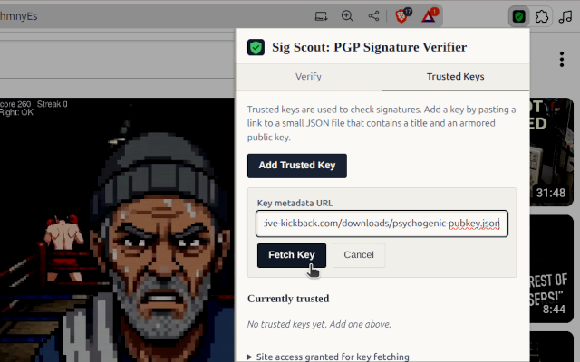
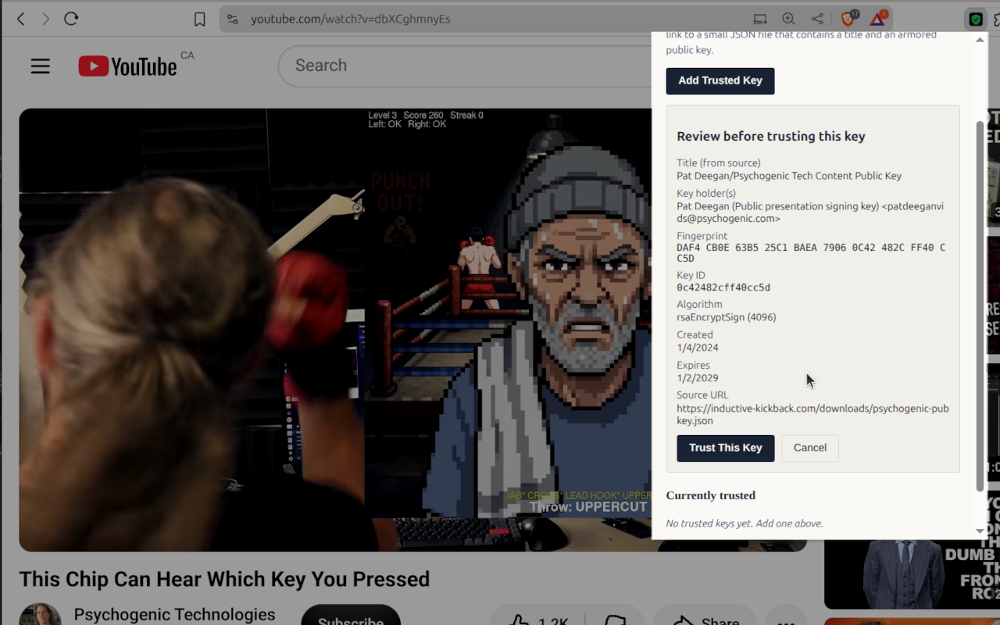
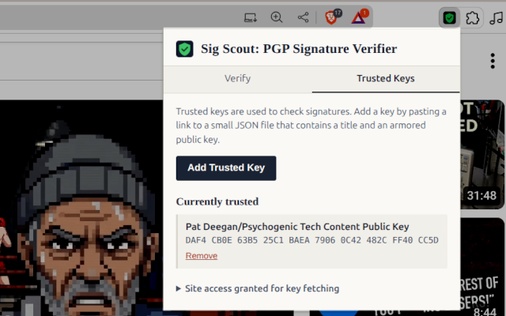
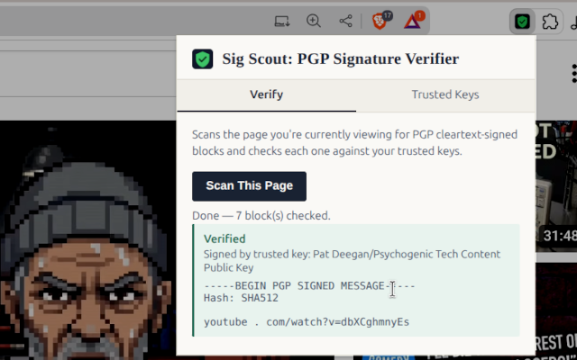

# Sig Scout PGP Signature Verifier (Chrome Extension)

How can you know your favorite creator actually made this video or post?

Anyone can deep fake anything now, so this is an easy way to check a web page for valid signatures


I have a video describing why this matters and how it works:

https://www.youtube.com/watch?v=ihiDrIOV9uc


But, rather than do everything manually, many have asked for an easier way and this is my proposal.

  1) You install this extension
  
  2) Creators publish and point you to a URL with meta-data, [like this](https://inductive-kickback.com/downloads/psychogenic-pubkey.json)
  
  3) You add this key to your set of trusted keys
  
Paste in that URL



Verify the details


Now it's in your set




  4) Hit scan page and the extension finds and validates the signature
  





And that's it.  I'll try to get this in the web store, but you can install it yourself using the information below.

To try it out:

 1) head to [one of my recent videos](https://www.youtube.com/watch?v=dbXCghmnyEs)
 
 2) Install the key from [https://inductive-kickback.com/downloads/psychogenic-pubkey.json](https://inductive-kickback.com/downloads/psychogenic-pubkey.json)
 
 3) Click Verify -> "Scan this Page"
 
 Yay

## Extension details

A Manifest V3 Chrome extension with two jobs:

1. **Verify** — on demand, scan the page you're viewing for PGP cleartext-signed
   blocks (`-----BEGIN PGP SIGNED MESSAGE-----` … `-----END PGP SIGNATURE-----`)
   and check each one against the public keys you've chosen to trust.
2. **Trust management** — import trusted public keys by pasting a URL to a small
   JSON file (title + armored public key), review the key's real details, and
   confirm before it's stored.

All cryptography is done locally in the browser with [OpenPGP.js](https://openpgpjs.org/)
(bundled in `lib/openpgp.min.mjs`, v6.3.1). No key material or page content is
sent anywhere.

## Install (unpacked, for development/personal use)

1. Open `chrome://extensions`.
2. Turn on **Developer mode** (top right).
3. Click **Load unpacked** and select this folder.
4. Pin the extension from the puzzle-piece menu so it's easy to reach.

## Try it with the included demo

`examples/demo-signed-page.html` contains a message signed by a throwaway demo
key, and `examples/demo-key-metadata.json` is that key's metadata file.

1. Serve the `examples/` folder over HTTP (fetching from a bare `file://` URL
   is unreliable/blocked in extensions, so a quick local server is easiest):
   ```
   cd examples
   python3 -m http.server 8000
   ```
2. Click the extension icon → **Trusted Keys** → **Add Trusted Key**.
3. Paste `http://localhost:8000/demo-key-metadata.json` → **Fetch Key**.
4. You'll be asked to grant the extension access to `localhost` — approve it.
5. Review the fingerprint/owner/algorithm shown, then **Trust This Key**.
6. Open `http://localhost:8000/demo-signed-page.html` in a tab.
7. Click the extension icon → **Verify** → **Scan This Page**.

You should see the block reported as **Verified**, and a green banner inserted
above it on the page itself. Try editing a word inside the `<pre>` block on the
page and rescanning — it should flip to **Failed**.

## The key-metadata JSON format

When you "Add Trusted Key," you give the extension a URL. That URL must return
JSON shaped like this:

```json
{
  "title": "Johnny Appleseed's Public Key",
  "owner": "Johnny Appleseed",
  "contact": "johnny@example.com",
  "publicKey": "-----BEGIN PGP PUBLIC KEY BLOCK-----\n...\n-----END PGP PUBLIC KEY BLOCK-----"
}
```

- `title` (required, string) — shown in your trusted-keys list.
- `publicKey` (required, string) — an **armored public key**, newline-escaped
  as valid JSON. Never put a private key here.
- `owner`, `contact` — optional, informational only, not currently displayed
  beyond the preview step, but harmless to include for your own bookkeeping.

Nothing else in the JSON is read. The extension never trusts the `title` field
alone — after fetching, it parses the actual key material with OpenPGP.js and
shows you the *real* fingerprint, key ID, user IDs, algorithm, and expiry
before you confirm. Treat this the same way you'd treat verifying a
fingerprint over a second channel: the JSON file's host is asserting "this is
so-and-so's key," and that's only as trustworthy as the site serving it.

## How it works internally

- **No content script runs automatically.** The manifest requests only
  `activeTab` + `scripting`, not a broad `<all_urls>` content script. Scanning
  only happens when you click "Scan This Page," and only touches the tab
  you're currently looking at — Chrome doesn't even show a scary "read and
  change all your data on all websites" warning at install time as a result.
- **Fetching a key's JSON also asks for narrow, revocable access.** The first
  time you add a key from a given site, Chrome will prompt you to grant
  access to that one origin (via `chrome.permissions.request`). You can see
  and revoke granted sites under Trusted Keys → "Site access granted for key
  fetching."
- **Verification logic** (`popup.js`, function `verifyBlocks`): each signed
  block is parsed with `openpgp.readCleartextMessage`, then checked against
  *all* your trusted public keys at once via `openpgp.verify`. Three outcomes:
  - `valid` — a trusted key's signature checks out.
  - `unknown` — the block is signed, but not by any key you trust (this is
    reported neutrally, not as tampering — it usually just means you haven't
    added that signer's key).
  - `invalid` — the content was signed by a key you trust, but the signature
    no longer matches (i.e., altered after signing, or corrupted).
- **Private keys are rejected on import.** `parseKeyForPreview` checks
  `key.isPrivate()` and refuses anything that isn't a public key.

## Known limitations

- **Whitespace matters.** PGP cleartext signatures cover exact text, including
  line breaks. The scanner reads `document.body.textContent`, not
  `innerText`, specifically to avoid whitespace-collapsing that would break
  otherwise-valid signatures — but a page that reformats/re-wraps text after
  the browser parses it (rare, but possible with some JS-heavy pages) could
  still cause a false "Failed" result. Putting the signed block in a `<pre>`
  tag is the most reliable way to publish one.
- **Top frame only.** The scan only looks at the tab's main document, not
  cross-origin iframes, to keep the permission model to exactly what
  `activeTab` grants.
- **On-page banners are best-effort.** They're inserted as inline elements
  right before the detected block; depending on the page's markup they can
  end up visually nested inside a surrounding box (e.g., inside a `<pre>`).
  The popup's result list is the authoritative source of truth regardless.
- **Automatic (page-load) scanning isn't included by design** — see below.

## Switching to automatic scanning on every page load

If you'd rather have it scan automatically instead of on click, you can add a
traditional content script. This trades away the narrower permission model:

```json
"content_scripts": [
  {
    "matches": ["<all_urls>"],
    "js": ["content.js"],
    "run_at": "document_idle"
  }
]
```

...where `content.js` calls `scanPageForPGPBlocks()` and sends the result to
the extension via `chrome.runtime.sendMessage` for verification. This will
make Chrome show the broader "read and change all your data on all websites"
permission warning at install time, since the content script now runs on
every page automatically rather than only when you click.
